# RTOS (Real Time OS)

## RTOS와 NON-OS의 차이

지금까지 코딩한 방식은 single thread (main 하나에 while문 돈다)

OS로 넘어오게 되면 multi-thread 방식이며, thread가 독립적으로 동작하는 것 처럼 보이게 된다.

| non OS | RTOS |
|-------|------|
|thread가 없다 | thread가 있다.|
|signle thread | multi thread|
|super Loop 형태의 programming 구조 | 각 thread에서 독립적인 programming 방식|

---

**non-RTOS**  


```c
int main(){
    while(1){
        listner()
        controller()
        presenter()
    }
}
```

**RTOS**  

  

```c
int main(){
    thread1_start(); //listener
    thread2_start(); //controller
    thread3_start(); //presenter
}
```

timer interrupt가 tick을 발생시켜 thread를 전환하는 역할을 한다.
FND 동작하는 방식과 비슷


**RTOS는 시간적으로 우선순위가 있는 할당방식**  
우선순위가 높은 thread가 있다면 우선 순위가 있는 thread를 먼저 동작시킨다.

***stm32CubeIDE에 free RTOS가 내장되어있다***


CMSIS OS는 ARM 사에서 제공해준다.

Free RTOS는 Kernel.

>회사에서 Free RTOS를 사용할지 어떤 OS를 사용할지 모른다.  
하지만 **RTOS 동작 개념, 특성, 주의사항**은 같다.  
단지 안의 Kernel 동작방식이 다를 뿐이다.

## Program vs Process vs Thread

### Program
메모리에 실행을 위해 load 되지 않은 `*.exe` 파일 그 자체

### Process
프로그램을 실행한 순간 `*.exe` file은 메모리에 공간을 할당받음. 이상태의 프로그램을 프로세스라고 한다. 

  

위 그림은 프로세스들이 운영체제로부터 별도의 메모리 공간을 할당받은 모습이다.  

### Thread
프로세스를 여러단위로 나눈 것

## Word
Register Size  
Register가 한 번에 처리할 수 있는 양

64bit 컴퓨터: Register가 한 번에 처리할 수 있는 양이 64bit

# 초기 설정

## Free RTOS 선택  


## CMSIS V1 선택  


## ADD Task 하기


### 스택 사이즈


해당 thread가 차지하는 STACK 사이즈.
현재 ARM Core는 4byte 이므로 STACK 은 128X4byte가 된다.

### 우선순위

  

위에서 아래로 갈수록 우선순위가 높아짐

### 함수이름


이렇게 설정하기!


이렇게 생성하면 WARNING이 하나 뜬다.  


1.RTOS도 SysTick을 사용하여 interrupt를 발생시키게 되는데, Systick은 HAL이 사용중임
따라서 HAL이 Systick을 사용하지 않게 바꿔야함

따라서 다시 돌아와서 SYS의 Timebase Source를 TIM11로 변경하자.  


2.USE_NEWLIB_REENTRANT 설정 필요  
현재: newlib는 STM32에서 사용하는 C 라이브러리, 기본적으로 비재진입성 (non-reentrant)

문제: RTOS를 쓰면 여러 쓰레드가 동시에 printf 같은 C 라이브러리 함수를 사용할 수 있는데, 이때 충돌이 날 수 있음

해결: USE_NEWLIB_REENTRANT 옵션을 활성화하면, 라이브러리를 재진입 가능하게 만들어줌


# Thread

```c
osThreadId defaultTaskHandle;
osThreadId myLed1Handle;
osThreadId myLed2Handle;
osThreadId myLed3Handle;
```

thread를 만들면 메모리에 STACK memory 공간이 생긴다. (각각 독립적인)


non-OS프로그램에서는 메모리 공간 맨 위에서 stack pointer가 내려와서 다 공유했었음.  
이제는 thread별로 stack pointer가 내려와서 독립적으로 자신만의 stack 공간을 사용  
각 Thread가 자신만의 Stack을 가지게 되어 안정적인 멀티태스킹이 가능해짐

thread가 돌아가며 CPU를 점유함 -> `스케줄링`

스케줄을 정해주는 애 -> `스케줄러`


Thread를 Context라고 함

context가 CPU 점유 변경 -> context switching

***context switching을 scheduler가 해준다!!***

FSM 상태 변화도 context switching 의 한 종류


```c
  /* Start scheduler */
  osKernelStart();

  /* We should never get here as control is now taken by the scheduler */
```

얘가 실행이되면 스케줄러가 실행이된다.
osKernelStart()가 실행되면 그 밑에있는 코드들은 절대 실행안된다.
스케줄러에 의한 코드들만 알아서 스위칭되며 실행됨


# Free RTOS Scheduling
## CMSIS RTOS
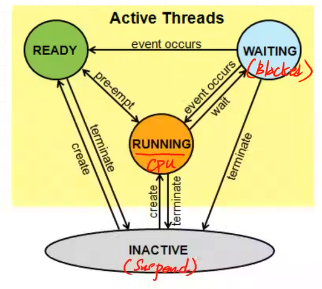
thread 상태 (Ready, Running, Waiting, inactive)


## Free RTOS
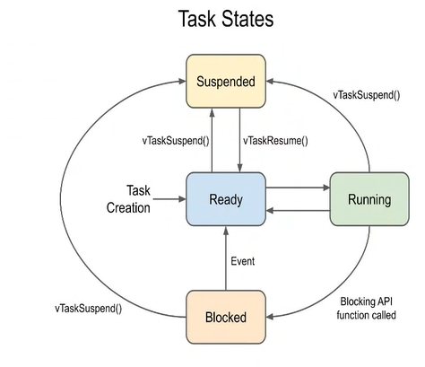

thread 상태 (Ready, Running, Blocked, suspended)  
CMSIS RTOS랑 같은데 단어만 다른거  
FSM 구조임  


`Running`: CPU 점유중인 thread. 오직 하나의 thread만 점유할 수 있음  
`Wating`: CPU 점유를 기다림  
대기하는 쪽으로 넘기는 명령어가 `osDelay()`  
`osDelay()`가 호출되면 해당 thread는 Waiting(BLocked)상태로 바로 진입  

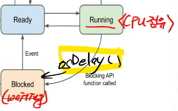

```c
HAL_GPIO_TogglePin(GPIOA, GPIO_PIN_1);
osDelay(500); //여기서 delay 끝날때까지 blocked, delay끝나면 Ready로
```

`Ready`: `Wating` 끝난 thread들이 CPU 점유 가능할 때 까지 대기.  
우선순위가 높은 thread가 CPU를 점유한다.  
우선순위가 같으면 먼저 Ready상태에 진입한애가 먼저 Running 상태로 진출

`suspended`: task를 멈추는 것.

OS Kernel에서 이 작업을 자동으로 해준다.


---
# Listner, Controller, Presenter가 각각의 thread로 동작하고 각각의 스택을 가지고있다면, 어떻게 서로 공유하나?

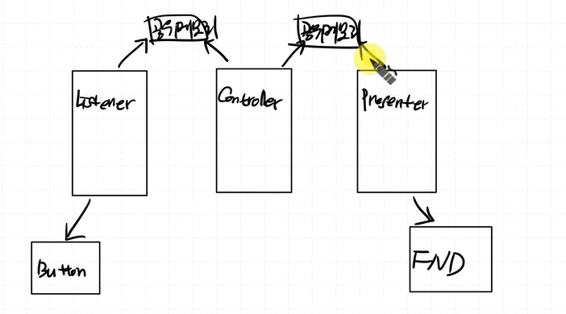

외부에 공유메모리(큐)를 잡아놓는다.

systemVerilog 에서 사용했던 mailbox가 위의 큐이다.  
큐를 아래처럼 생성할 수 있음  
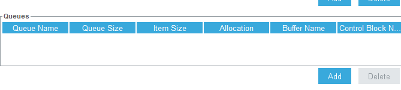  


systemVerilog에서의 event를 아래처럼 쓸 수 있음  
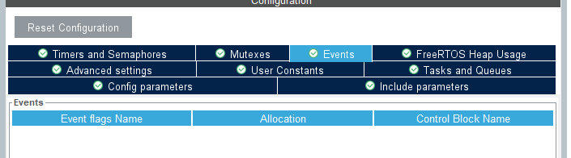  


***RTOS 질문 ***  

RTOS에서 공유자원 관리를 어떻게 하나?  

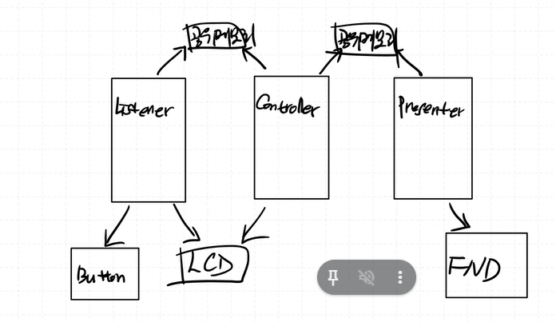

**1.`mutex`**  
동기화 방식으로 사용
한 번에 하나의 태스크만 자원에 접근 가능하도록 하는 상호 배제 객체.  
자원에 접근할 때 `mutex_lock`, 작업 후 `mutex_unlock`으로 보호한다.  

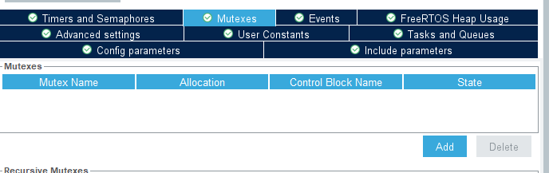

**2.`Semaphore`**
뮤택스랑 비슷한 방식


# 기존 Queue의 문제점

QUE_SIZE가 고정되어있다!

그래서 구조를 좀 고치려함
```c
typedef struct {
	int front;
	int rear;
	int typeSize;
	void *queData[QUE_SIZE]; //포인터 배열. (주소를 저장할 수 있는 배열)
}Que_TypeDef;
```

Que배열을 void 형으로 바꿈. (어떤 형도 될 수 있다. 구조체도 가능)

## 메모리 공간 할당
- malloc
    - 동적 메모리 할당
    - heap 메모리 영역에 할당
    - free() 실행전까지는 heap 영역에 메모리 공간 유지

```c
void Que_Init(Que_TypeDef *q, int type_size)
{
	q->front = 0;
	q->rear = 0;
	q->typeSize = type_size;
	for(int i=0; i<QUE_SIZE; i++){
		q->queData[i]=malloc(q->typeSize); 
	}
}
```


ex) typeSize가 8이라면?  

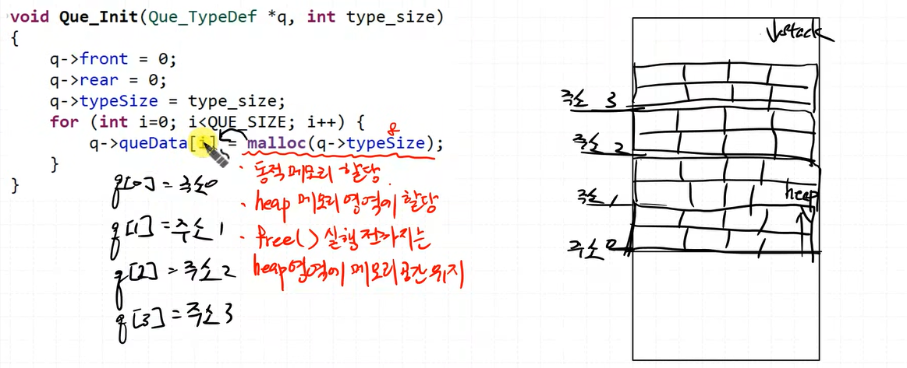  

## 메모리공간 해제
```c
void Que_DeInit(Que_TypeDef *q){
	for (int i=0; i<QUE_SIZE; i++){
		free(q->queData[i]);
	}
}
```

## 포인터의 자료형이 어떤 자료형이 올지 모르니 void로

```c
void enQue(Que_TypeDef *q, void *pData)
```


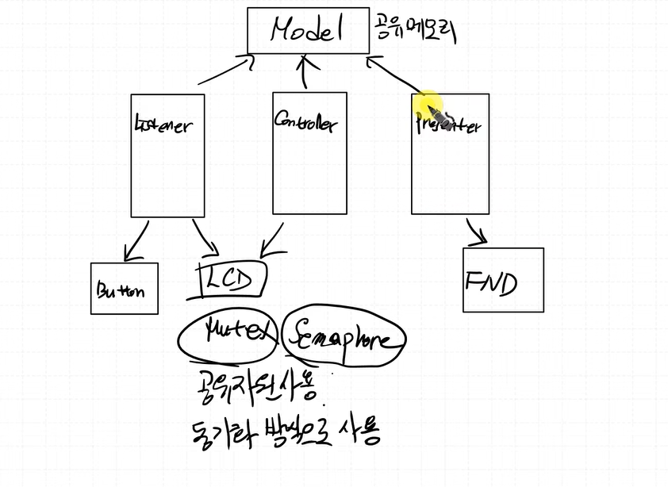


컨트롤러는 Queue만 바라보다 동작한다.
```c
void Controller_Mode()
{
	if(isQueEmpty(&btnQue)){
		return;
	}
	deQue(&btnQue, &btnWatch);

	switch(modeState)
	{
	case S_TIME_WATCH:
		if (btnWatch.id == BTN_MODE) {
			modeState = S_STOP_WATCH;
		}
		TimeWatch_Excute();
		break;
	case S_STOP_WATCH:
		if (btnWatch.id == BTN_MODE) {
			modeState = S_TIME_WATCH;
		}
		StopWatch_Excute();
		break;
	}
}
```
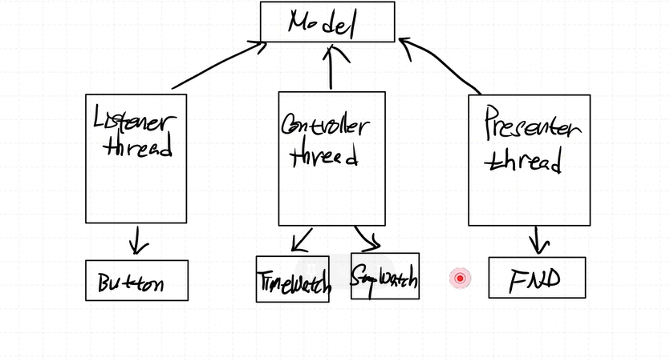

