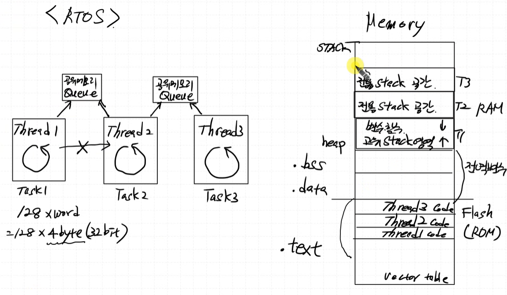


Thread마다 아래 Register를 보유한다.

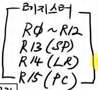  

# TCB(Task(Thread) Control Block)

레지스터 (r0~r12, r13(sp), r14(lr), r15(pc)) + stack 정보 를 가지고 있는 block

각 thread는 각 TCB를 가지고있음

<https://recipes.tistory.com/361>

# Scheduling Task 상태

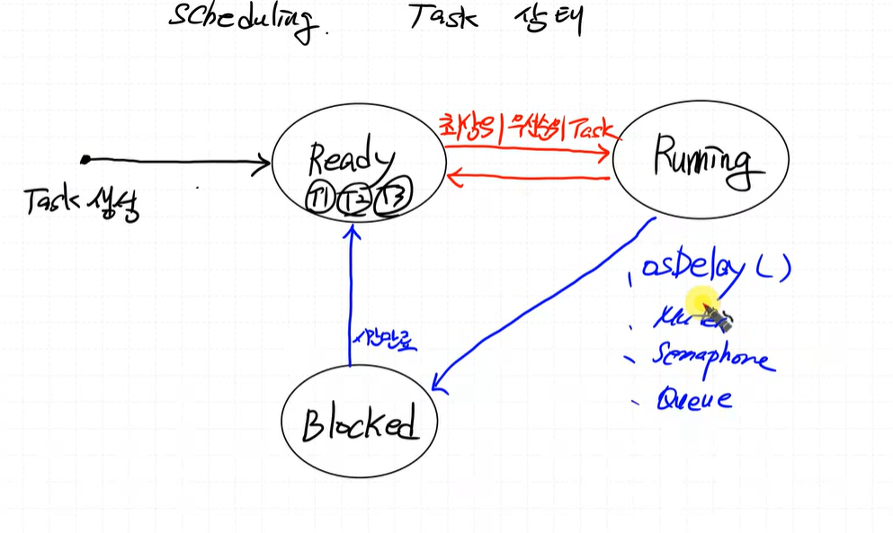


우선순위가 같다면 먼저 들어온 순서로 `Ready -> Running`으로 넘어가게되고 이를 `RoundRobin` 방식이라고 한다.


이스라엘 전쟁, rtos 중요. 자소서에 쓰면 좋을듯
무기의 주요 기능의 경우 thread 우선순위를 높인다.

# Hard Real Time, Soft Real Time

몇 ns 관련된건 Hard Real Time을 사용..(무기 관련)
Soft Real Time


|구분|	Hard Real-Time|	Soft Real-Time|
|----|----------------|---------------|
|시간 제한|	절대 지켜야 함|	지키는 게 좋음|
|시간 초과 시|	시스템 실패|	성능 저하, 계속 동작|
|예시	|에어백, 인공 심장	|영상 스트리밍, 게임|
|RTOS 필요성|	필수	|주로 사용|


기본적으로 task2가 계속 동작을 해야하지만 

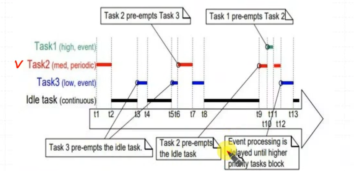

`t5~t8`을 보면 task3가 동작이 안끝났는데 task2가 ready에 들어와서 task3가 비키고 task2가 동작. task2 동작이 끝나고 나서야 task3가 동작.

`t9~t12`도 보면 task2 동작 중에 task1이 ready로 들어와서 task2가 ready로 빠지고 task1이 running으로 들어온 상황.

***이걸 알면 Kernel을 아는거***

> TCB가 레지스터 정보를 저장하고 있어서 (스택포인터, program counter 등) task가 우선순위에 밀려 중간에 ready로 가더라도 다시 running으로 갔을 때 이어서 작업할 수 있다.

# 실습1
버튼, LED Task 만들고 테스트해보기.

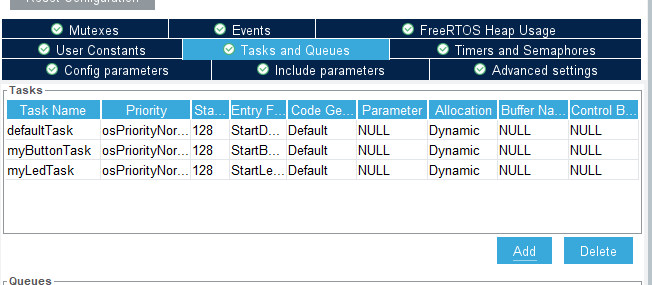  


**현재 SW STACK**  

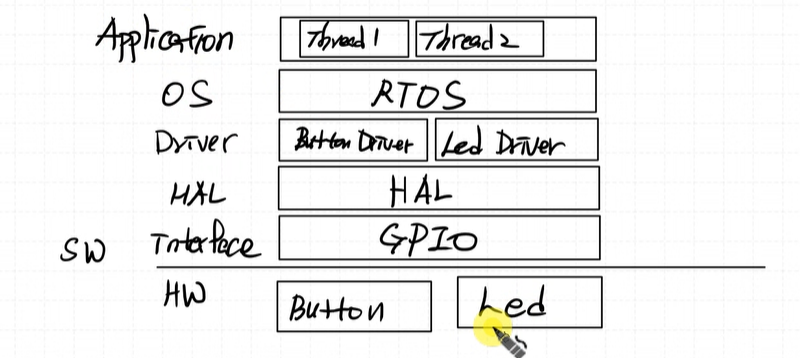


보통 Application을 `SW`라고 한다.

HW와 SW 사이에 끼어있는 애들을 `Middle Ware`라고 한다.

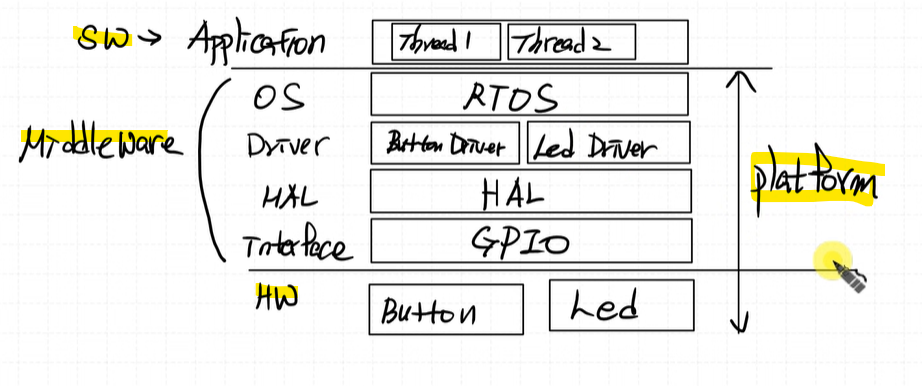

> **Platform**  
`HW~OS`까지를 Platform이라고 한다.  

---

```c
osThreadDef(myButtonTask, StartButtonTask, osPriorityNormal, 0, 128); //TCB 정보가 여기 들어가게된다.
myButtonTaskHandle = osThreadCreate(osThread(myButtonTask), NULL); //scheduler의 ready 상태로 진입
```

## 주의할 점

thread task 안에 꼭 `osDelay(1)` 이상인 명령어가 있어야한다.!!

`osDelay`가 없으면 Running을 계속 점유하게 되어 다른 task들이 접근을 못한다.


## Mutex

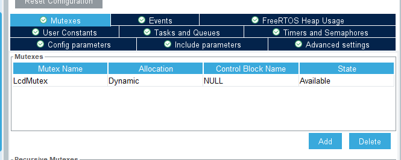

thread 2개에서 LCD 출력할ㄹ때 osdelay가 작으면 lcd 화면이 깨지는 문제가 생긴다.

-> 뮤텍스를 추가하자


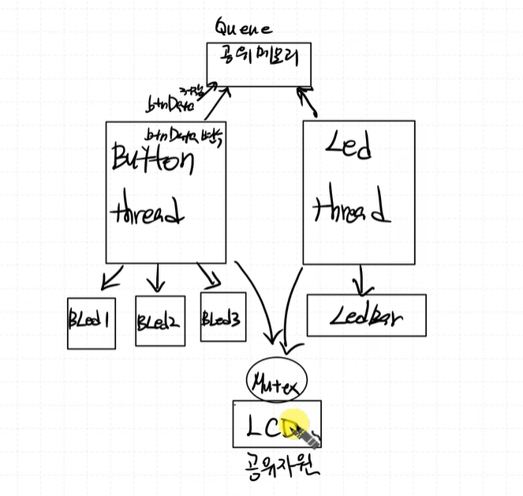  


```c
else if (btnData.id == BTN_LED3){
    ledData ^= (1 << 3);
    LedBar_Write(ledData);
    osMutexWait(LcdMutexHandle, osWaitForever); //화장실 문닫고 문 잠금
    LCD_writeStringXY(1, 0, "LED3");
    osMutexRelease(LcdMutexHandle); //화장실 문 염
}
```


[우리가 만든 my_queue로 하는거](./v00/) 

# 제공해주는 queue 사용하기

```c
osMailQDef(btnMail, 4, btn_led_t);
osMailQId btnMail;
```

## btnMail 만들어줘야함
init에다가 이거 추가
```c
/* USER CODE BEGIN RTOS_QUEUES */
/* add queues, ... */
btnMail=osMailCreate(osMailQ(btnMail), NULL);
/* USER CODE END RTOS_QUEUES */
```

## Enque의 경우
```c
//btn_led_t btnData = {0}; -> 이거 아래처럼으로 바꿔버리기

btn_led_t *btnData; //포인터 변수로 선언


//		  MyenQue(&qBtnLed,&btnData); -> 이거 아래처럼 바꿔버리기

btnData = osMailAlloc(btnMail, osWaitForever); // 동적 메모리 할당 받고 그 주소를 포인터 변수에 저장하기 
btnData -> id = BTN_LED1;
osMailPut(btnMail, btnData);

```

`osWaitForever` 동적 메모리 할당 받을 공간이 없을 수도 있으니 공간이 나올 때 까지 기다리는거

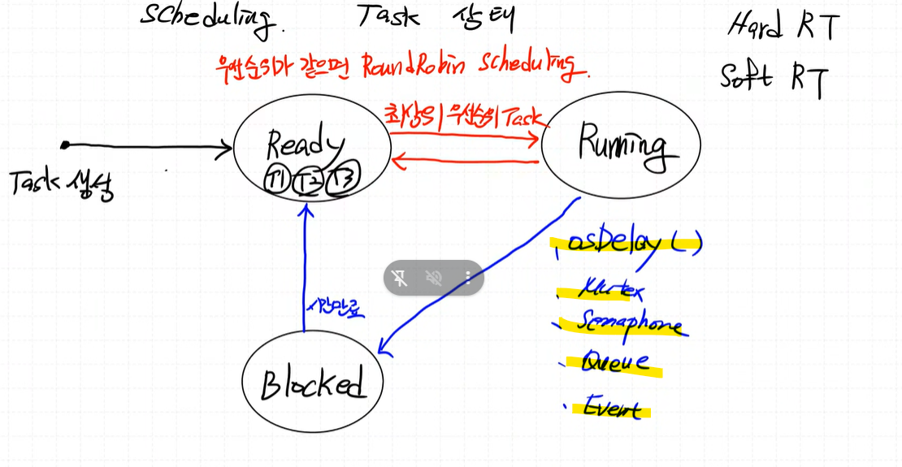

wait을 만나면 `Blocking` 상태로 들어감  


## Deque의 경우
```c
evt = osMailGet(btnMail, osWaitForever); //pop 할 수 있을 때까지 기다림
if (evt.status == osEventMail){
    btnData = evt.value.p; //값의 주소를 넣어주는 것

```


thread 생성할때마다 stack 잡아먹히고 tcb 공간 잡아먹혀서 메모리가 꽤 먹는다.

뭐할때마다 thread 생성하는건 비효율적일 수 있다.


# Interrupt

Interrupt를 호출하는걸 ISR Routine이라함

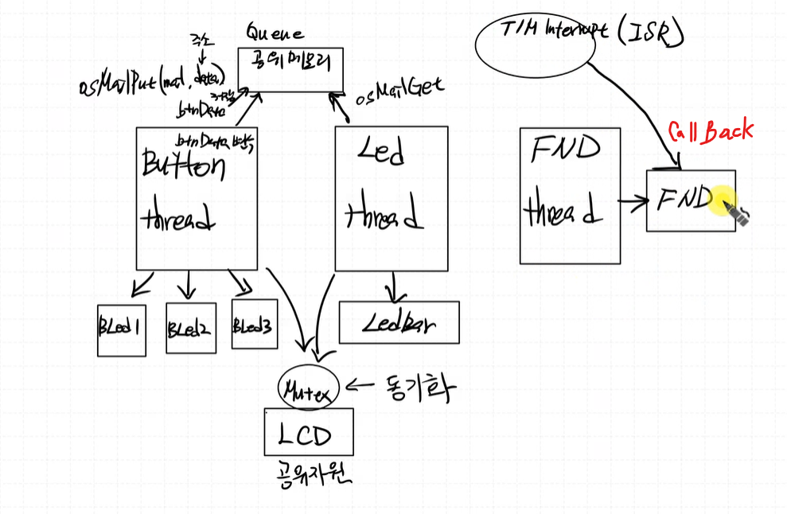