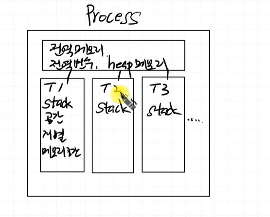
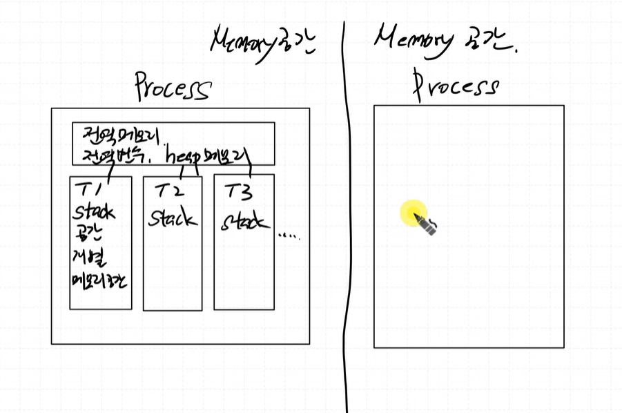
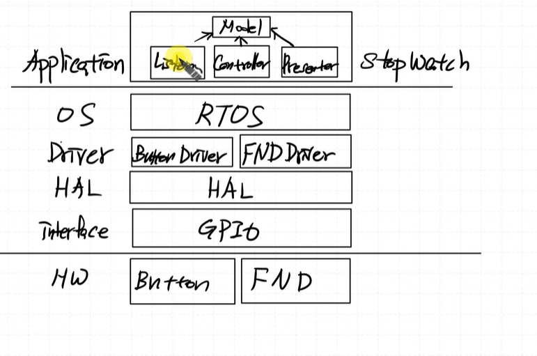
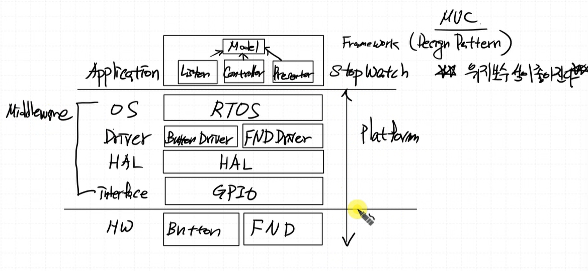
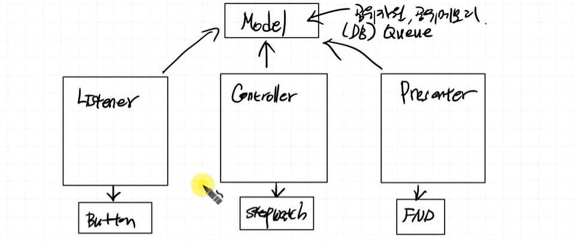
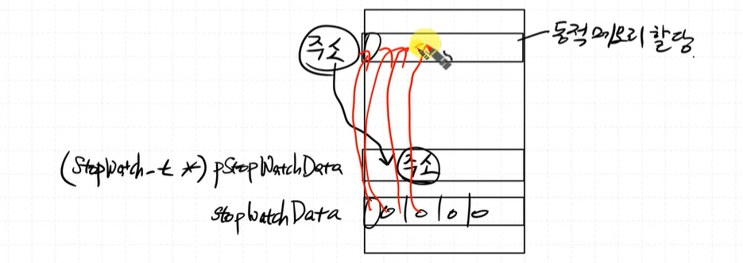

# Process와 Thread 차이

  

한 Thread가 다른 Thread의 stack에 접근 불가 (접근하면 해킹임)


1Process와 2Process의 메모리 공간은 별개로 존재.(독립적인 메모리 공간)  

  

Process1에서 Process2로 접근하는 것을 허용해주는 합법적인 방법이 `디버거툴`임  

> 임베디드 시스템은 보통 single Process에 multi-thread.
여기에 linux를 올린다하면 보통 multi-Process에 multi-thread


## IPC

Inter Process Communication (프로세스간 통신)
Process 1에서 Process 2에 메시지를 보내는 방법이 IPC가 되겠다.

예시) TCP, UDP..

프로토콜은 데이터를 주고받을 때 어떤 순서, 어떤 형식, 어떤 의미를 가질지 약속하는 것


## UI와 Processing 코드 분리해야한다.

스파게티 코드를 피할 것

### "UI와 Processing을 분리한다"는 뜻

- UI (User Interface): 화면에 보여지는 것 + 사용자가 직접 조작하는 부분
- Processing (처리 로직): 실제로 일을 처리하는 코드

만약 UI와 처리 로직이 한 코드에 섞여 있으면
UI를 바꾸려고 해도 로직이 엉켜서 수정하기 어렵다.
재사용이 어렵다.
테스트가 힘들다.
유지보수가 복잡해진다.

> 따라서 UI는 UI만, 처리 로직은 처리 로직만 담당하도록 역할을 구분하는 것이 좋다.


# 기존 모델을 Listener, Controller, Presenter로 확장하자

## SW Stack

  

Model은 공유메모리.

## FrameWork (Design Pattern)  

미리 만들어진 구조. 
디자인 패턴은 종류가 굉장히 다양. 

    ex) MVC Pattern

MVC Pattern을 비스무리하게 따온게 Listener, Controller, Presenter 구조

이렇게 구조를 만들고 코딩을하면 생성, 변경, 삭제, **유지보수**가 편하다.


  

## Getter와 Setter

```c
static eStopWatchState_t stopWatchState = S_STOPWATCH_STOP;

void Model_SetStopWatchState(eStopWatchState_t state){
	stopWatchState = state;
}

eStopWatchState_t Model_GetStopWatchState(){
	return stopWatchState;
}
```

외부 프로그램에서 변수에 직접적인 접근을 하지말고 함수를 이용하여 접근하라




StopWatch 정보를 Controller에서도 사용하고, Presenter에서도 FND 출력을위해 사용하니 StopWatch 정보를 Model 쪽에 저장해야한다.

## 큐 만들기

```c
osMessageQDef(stopWatchEventQueue, 4, uint16_t);
stopWatchEventMsgBox = osMessageCreate(osMessageQ(stopWatchEventQueue), NULL);
```

`osMessageQDef`  : 큐 이름, 개수, 자료형 정의  
`osMessageCreate`: 실제로 메모리 공간에 할당  


## osEvent 사용
osEvent는 큐가 아니며 큐에서 데이터를 꺼냈을 때 리턴되는 "결과"를 담는 구조체임.
큐의 상태 + 꺼낸 데이터가 함께 담겨있는 패키지


### osEvent 구조

```c
typedef struct {
  osStatus status;    // 상태: 메시지 꺼냄? 에러? 타임아웃?
  union {
    uint32_t v;       // 꺼낸 메시지 (숫자형 데이터)
    void *p;          // 꺼낸 메시지 (포인터 데이터)
    int32_t signals;  // 시그널 정보
  } value;
} osEvent;

```

### osMessageGet 함수

큐에 접근해서 데이터를 pop 해주는 함수 + 이벤트 상태 반환 (메시지 실제 있는지 없는지, 에러여부 등)

```c
osEvent evt = osMessageGet(stopWatchMsgBox, 0); //non blocking 형태
uint16_t evtState;

if (evt.status == osEventMessage){
    evtState = evt.value.v; //value 값 (uint32_t) 를 꺼내는 것
}
```

`osEventMessage`는 `osMessageGet` 함수를 호출했을 때 정상적으로 메시지를 꺼냈다는 것을 알려주는 상태 코드

### osMessagePut 함수

큐에 접근해서 데이터를 push 해주는 함수

```c
osMessagePut(stopWatchEventMsgBox, EVENT_RUN_STOP, 0);
```


# osMail과 osMessage의 차이

Mail은 pointer를 넘겨주고 Message는 value를 넘겨주는게 일반적임


아래코드 보기
```c
stopWatch_t stopWatchData;

void StopWatch_Init(){
	stopWatchData.hour =0;
	stopWatchData.min =0;
	stopWatchData.sec =0;
	stopWatchData.msec =0;

	stopWatch_t *pStopWatchData = osMailAlloc(stopWatchDataMailBox, 0); //1) 이 코드가 의미하는거 
	memcpy(pStopWatchData, &stopWatchData, sizeof(stopWatch_t)); //2)
	osMailPut(stopWatchDataMailBox, pStopWatchData); //3)
}
```

1) stopWatchData는 구조체, pStopWatchData는 주소를 저장하는애    


아래코드는 Heap에 동적메모리를 할당하고, 그 주소를 pStopWatchData에 저장하는 코드.
```c
	stopWatch_t *pStopWatchData = osMailAlloc(stopWatchDataMailBox, 0); //1) 이 코드가 의미하는거 
```

2) pStopWatchData의 값을 stopWatchData로 카피하는 코드


3) stopWatchDataMailBox에 pStopWatchData의 값을 큐에 저장


아래 코드 보기
```c
stopWatch_t *pStopWatchData;
osEvent evt = osMailGet(stopWatchDataMailBox, osWaitForever);
if(evt.status == osEventMail){
    pStopWatchData = evt.value.p;
    Presenter_StopWatch_FND(pStopWatchData);
    Presenter_StopWatch_LCD(pStopWatchData);
    osMailFree(stopWatchDataMailBox, pStopWatchData);
}
```

메일 큐는 미리 정해진 크기의 메모리 블록을 할당한후에(heap 공간에 따로 저장할 공간을 마련) 큐에 이 heap pointer를 집어넣는애
`osMailGet()` 은 큐에서 pop까지만 해주는 함수, `osMailFree()`는 가져온 메모리를 해제해주는 함수

그러니까
`osEvent evt = osMailGet(stopWatchDataMailBox, osWaitForever);` 얘는 큐에서 데이터 포인터를 pop하는 것, 이 시점에서 큐는 pop되지만 이미 할당한 heap에 존재하는 메모리 공간은 아직 있음.

따라서 `osMailFree`를 통해 이 메모리를 해제해 주어야 하는 것

