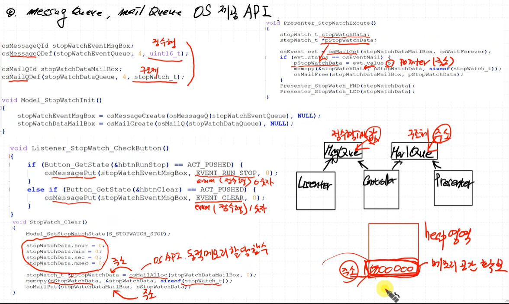
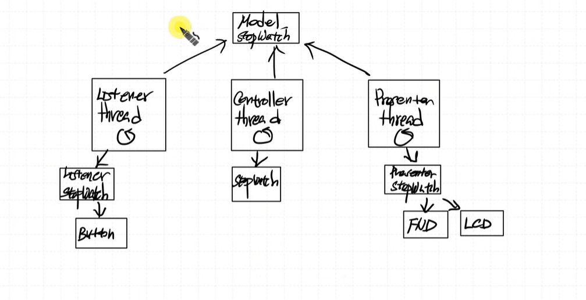
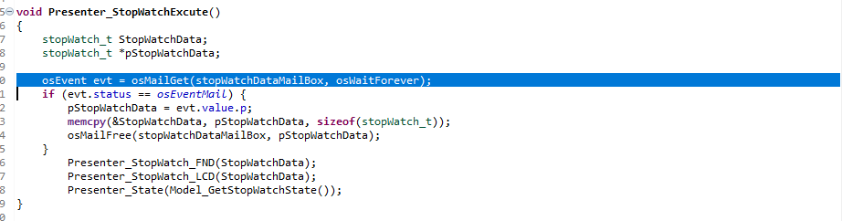
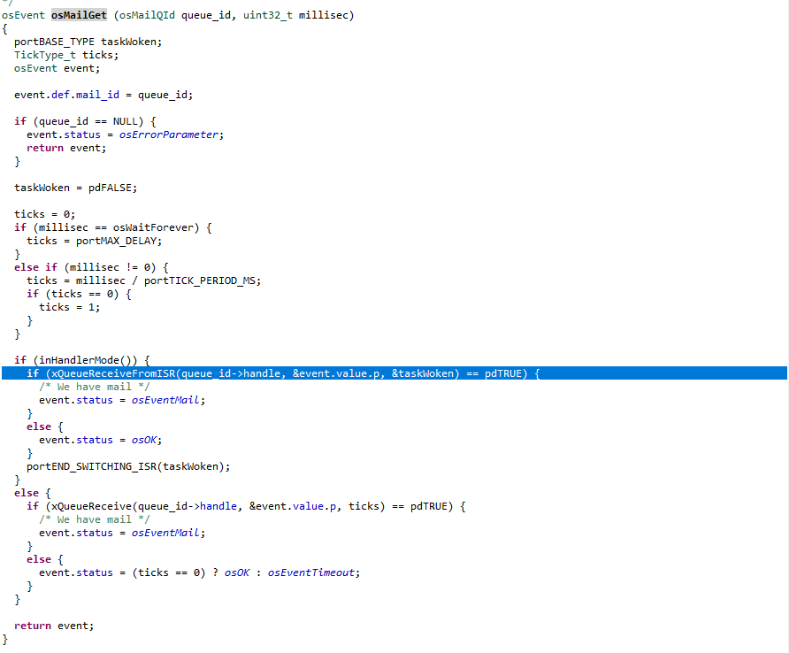
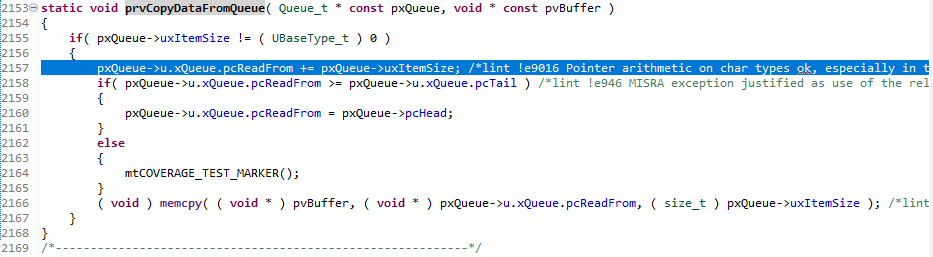
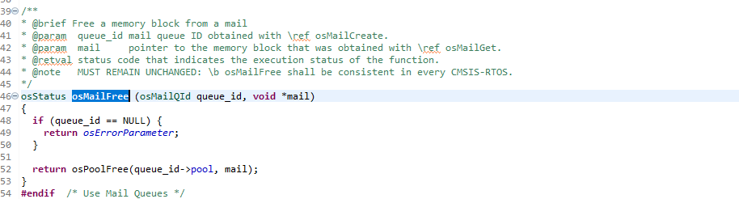
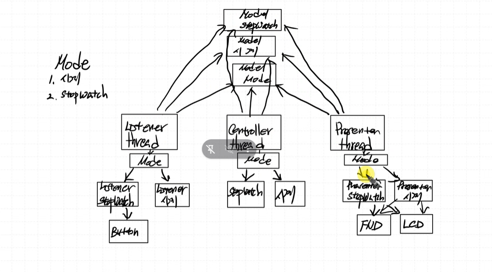
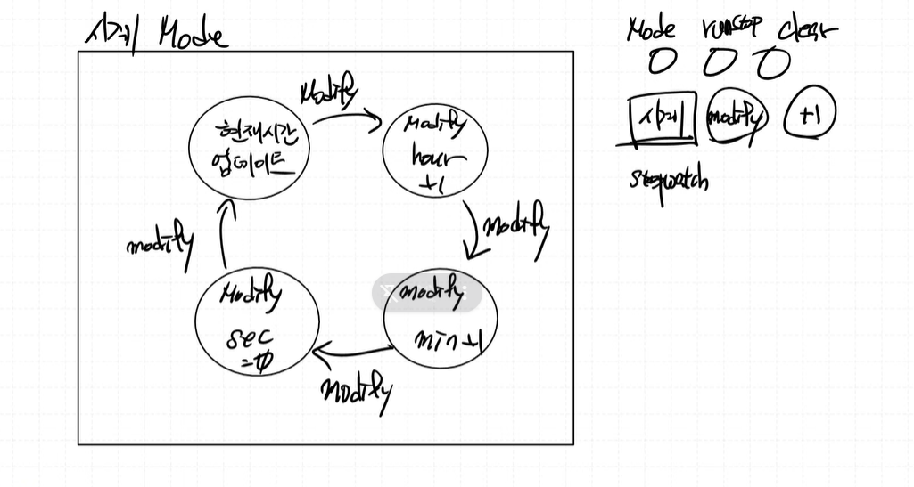
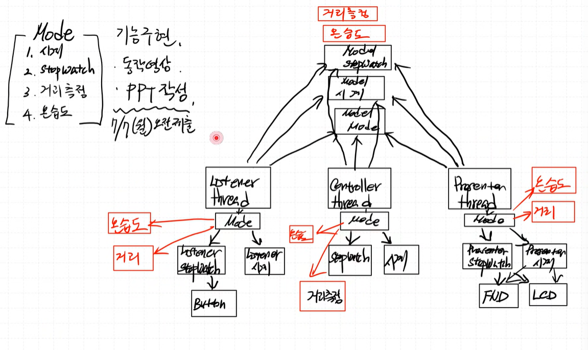

# message Queue와 Mail Queue의 차이

동적할당이 계속 유지되는 현상을 "메모리 leak"이라고 한다. (메모리 다 사용하고 반환안해서 생기는 일)

- Message Queue는 값을 집어넣을때 사용
- Mail Queue는 포인터 집어넣을때 사용

  

  

  

osMailGet을 하면 스택의 head, tail 포인터만 관리하게 된다. (실제로 tail pointer가 +1 증가하며 pop)

osMailFree를 하게되면 동적할당한 메모리 반납.

# Watch 추가

# 시간 조정기능 추가

Normal 상태와 Modify 상태로 나뉜다.

# 숙제
