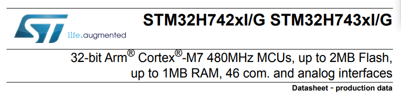
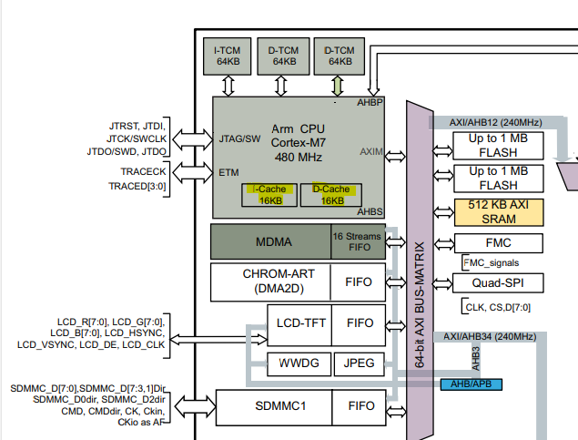
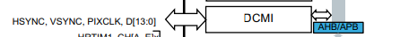
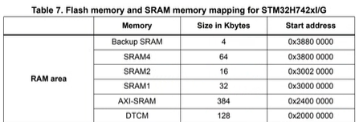
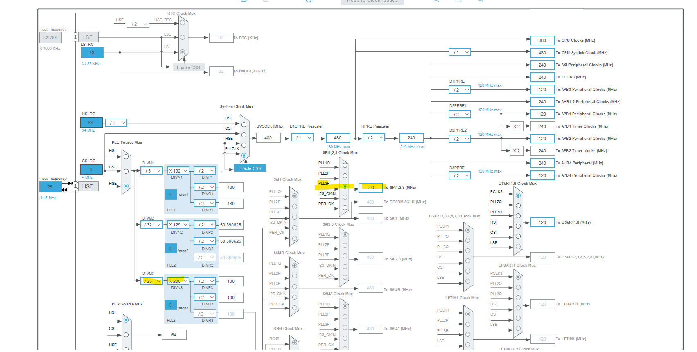

  

새로운 보드

CPU가 처리하는 속도는 `480Mhz`

캐시메모리가 있어서 좀 더 빠르다. (d cache(data cache), i cache(instruction cache))  

16 Kbytes of data and 16 Kbytes of instruction cache  

  

# DCMI

Data Camera Interface  

Camera 영상처리를 위한 카메라 모듈이 HW 적으로 탑재되어있다.  
DCMI의 CLK은 AHB2 bus에 연동되어 `240MHz`로 동작한다.  
APB는 `120MHz`로 동작.  

  

# MPU (Memory Protection Unit)

MPU 설정이 필요함

AXI-SRAM 사이즈가 512KB  
RAM Area는 나누어져 있다.  

CPU가 480MHz 인데 나머지 버스들 클럭이 훨씬 느리다.
따라서 캐시가 중간 버퍼 역할을 해주어 480MHz 로 무사히 동작할 수 있도록 해준다.

# DMA (Direct Memory Access)

D Cache는 CPU 전용 고속 임시 저장소.
DMA는 CPU를 대신해서 메모리에 접근하여 메모리 read/write을 수행한다. 
DMA는 Data Cache에 접근이 불가하고 오직 RAM에만 접근한다.

# FMC

DRAM 연동하는 모듈

# LCD 추가
SPI 로 나가는 clk 속도 100MHz로 변경
