SPI 설정

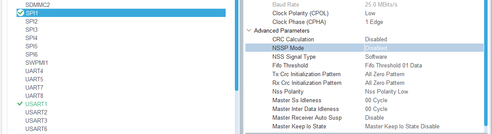

NSSP Mode Disable 시키기

printf 문이 실행되면 아래 코드가 실행된다.

    extern int __io_putchar(int ch) __attribute__((weak));

    __attribute__((weak)) int _write(int file, char *ptr, int len)
    {
        (void)file;
        int DataIdx;
        for (DataIdx = 0; DataIdx < len; DataIdx++)
        {
            __io_putchar(*ptr++); //근데 이게 함수 이름만 적혀 있어서 우리가 정의해줘야함
        }
        return len;
    }

main.c 에서 기술하기  
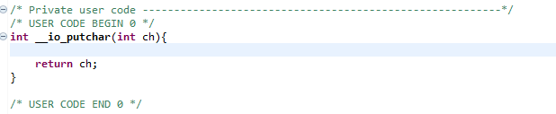  

printf 문이 실행되면 uart 통신을 통해 내보내는게 목적!

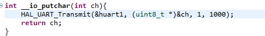

# DMA (Direct Memory Access)

D Cache는 CPU 전용 고속 임시 저장소.
DMA는 CPU를 대신해서 메모리에 접근하여 메모리 read/write을 수행한다. 
DMA는 Data Cache에 접근이 불가하고 오직 RAM에만 접근한다.

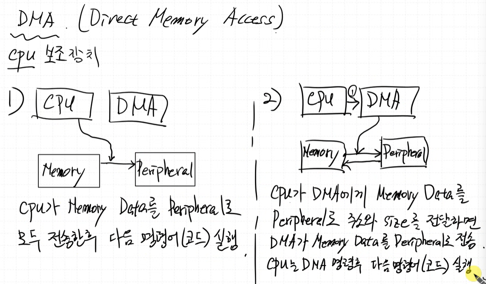

LCD SPI 를 DMA를 이용하여 동작하도록 세팅하기.

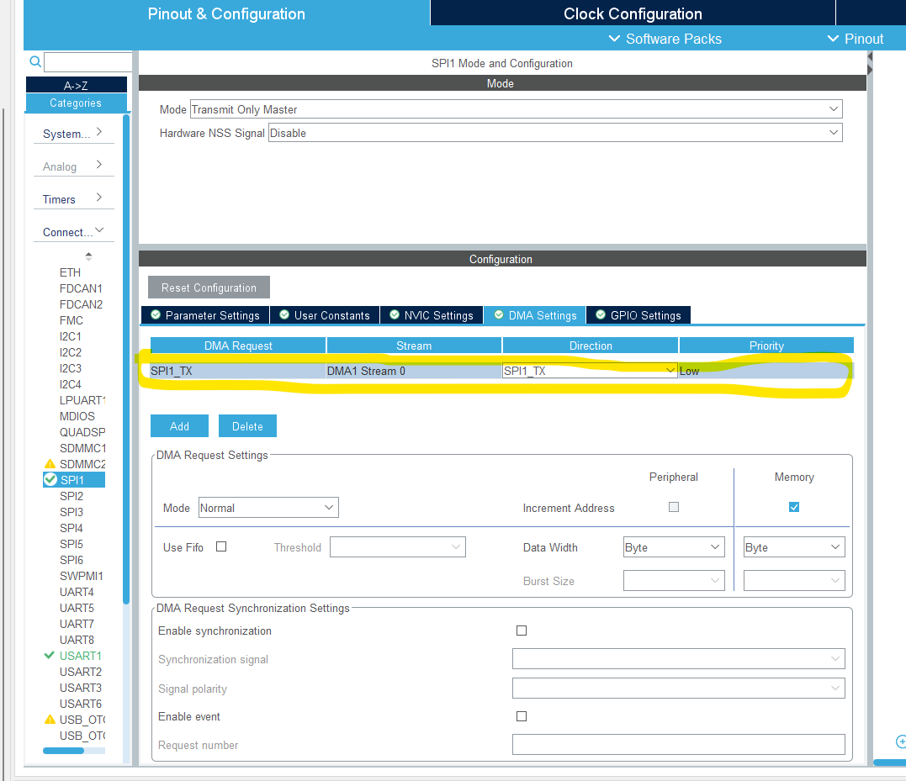

이렇게해야 병목이 걸리지않고 lcd 출력중에도 다른 동작 수행 가능

# 이미지 처리

이미지처리할때는 무조건 frame buffer 가 있어야함

tft lcd (display 장치) 에도 Grapic Memory 가 존재.

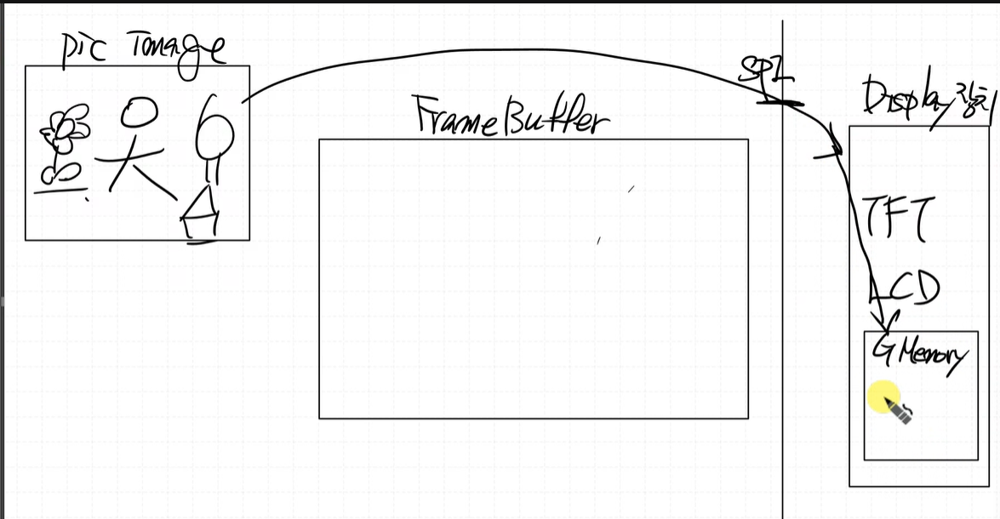  

목적은 pic image를 Display 장치의 메모리에 Write 하는 것.

인터페이스는 SPI 통신으로.

먼저 frame buffer에 이미지 처리를 한 데이터를 저장 한 후, 그 이후에 spi를 통해 TFT LCD의 Graphic Memory에 보낸다.

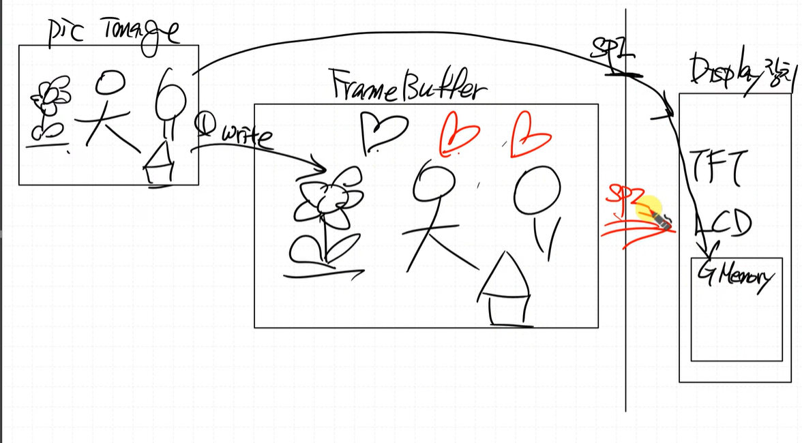

# 영상처리에서 더블 버퍼링을 많이 이용

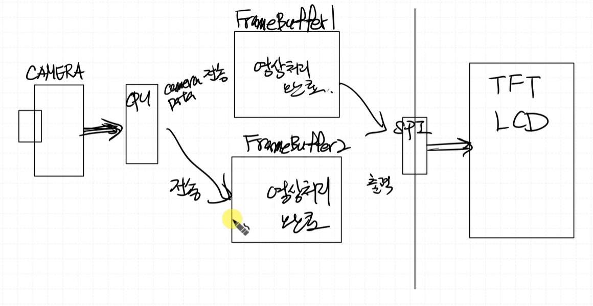

더블 프레임버퍼링, 더블 버퍼링

cpu에서 camera data를 frame buffer1에 먼저 전송하고 그다음 frame buffer1은 영상 데이터 처리 중,
cpu는 frame buffer1에 보냈으면 frame buffer2에 camera data 전송, 그럼 여기서도 영상 데이터 처리중,
그리고 spi 로 보내고 tft lcd로 전송됨

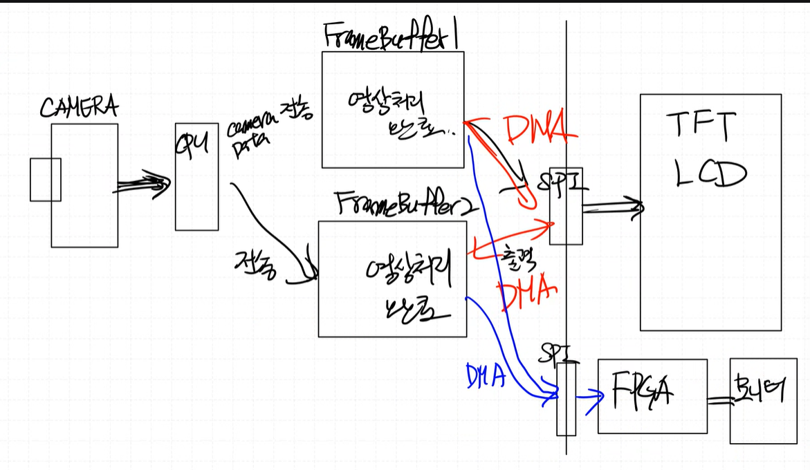

SDRAM 설정을 FMC에서 한다.

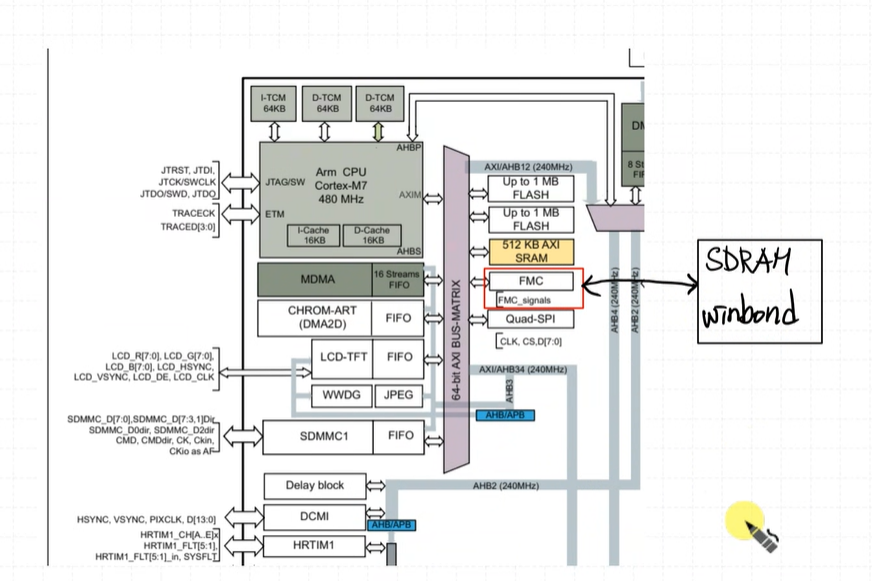

Connectivity -> FMC

아래처럼 설정하기  
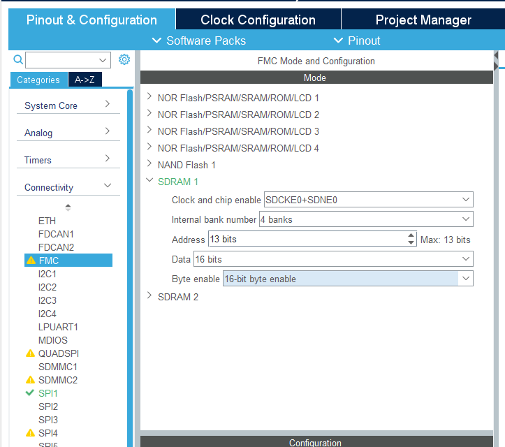  

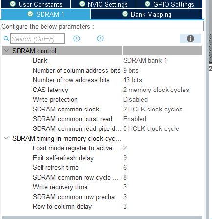

winbond 사에 맞춰서 세팅한거. 지금 winbond sram 사용중이라 요거 참고해서 세팅 하기 (`W9825G6KH`)

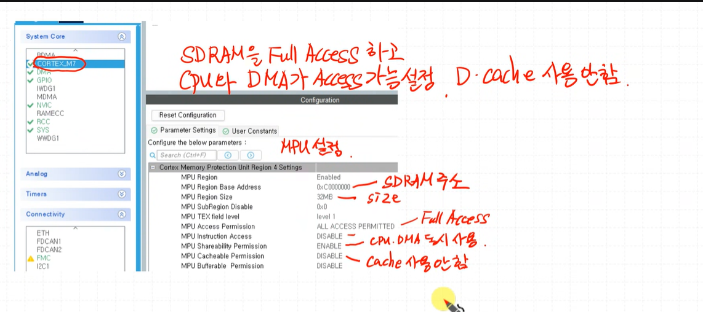

0xC00000000 : SDRAM 주소
32MB : SDRAM size
MPU Shareability Permission : PC와 DMA가 같이 access가 가능하도록 Enable 해주기
MPU Cachealbe Permission: D-캐시 사용안하도록 설정하기

# sdram read/write test

    SDRAM_initialize();

    uint32_t *sdramAddr = (uint32_t *)(0xC0000000);

    for (int i=0; i<100; i++){
        sdramAddr[i] = i; //write
    }
    for (int i=0; i<100; i++){
        printf("sdramAddr[%d] = %d\n", i, sdramAddr[i]); //read
    }

